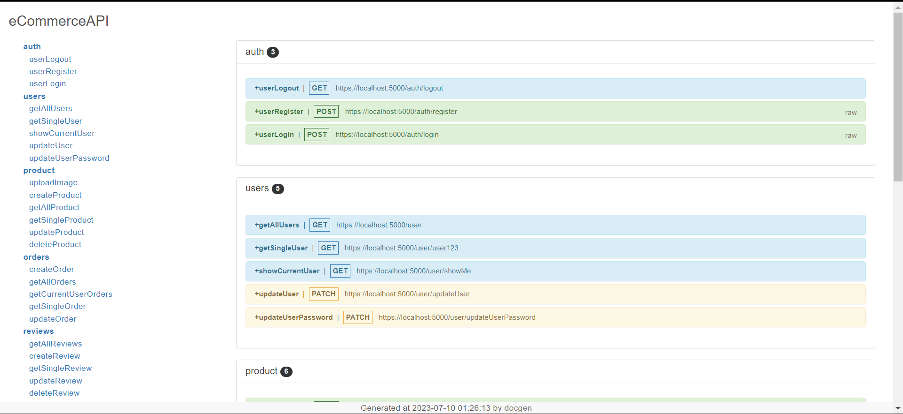

# Introduction

In short, This project is a RESTful API service for an e-Commerce website. This project delves deep into the functionality of the back-end, where it explores how different e-commerce websites employ their services and the logic that has been inbuilt into them. This project has been built with a plethora of libraries that allows for safe and secures practise for it to be production ready.  

## Tools and Libraries
 * Node
 * Express
 * MongoDB
 * Mongoose
 * bCrypt

## Deployment 

The application's route documentation has been built using DocGen and deployed on Render https://ecommerceapi-j9hh.onrender.com/




### Localhost Deployment

To view the project, one can first download the project from the repository and then navigate to the folder of the same in terminal. Once accessed, run the following command in the terminal in order to download all necessary packages.

```
npm install
```
Once done, the project needs an additional .env file of your convinience which contains the following variables as stated below in the example.

```
PORT = 5000 || or any port you find suitable
MONGO_URI = "mongodb+srv://UsernName:<Password>@cluster0.mdpws4l.mongodb.net/<DatabaseName>?retryWrites=true&w=majority"
JWT_LIFETIME = 1d
JWT_SECRET = "st3v3n" - an example. You can generate one using safe practises.
```

The Mongo_URI string can be obtained after one creates a MongoDB account on Atlas (if not already created: https://www.mongodb.com/) and connects to a cluster within the same.

With that done, the project is pretty much ready to run. All you have to do is run the project using the following command 

```
npm run dev

```

You can view the route documentation of the localhost deployment on your browser using the URL, https://localhost:5000  or you can test out the routes using the PostmanAPI, whatever floats your boat. Hope that it clears up! :^) -->

#### Additional Improvements for the Project: 

> add frontend 

> add reccomender engine

> explore more on seperating user and admin roles. 
